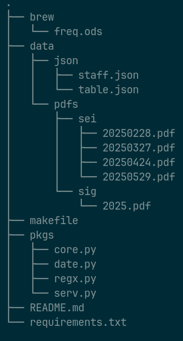

# SEIME

Registrar em planilha a frequência dos servidores às reuniões do Conselho
Diretor do [IME][]. Para tanto, o script capta informações de documentos
(manualmente) baixados dos sistemas [SEI!][] e [SIGRH][]. Orgulhosamente livre
de `IA`.

## Estrutura

O projeto possui a seguinte estrutura:



Todos os dados de entrada ficam armazenados na pasta `data`.

- `data/json/staff.json`:

    Este arquivo contém informações sobre os servidores, como matrícula `SIAPE`
    e nome completo, além de armazenar datas em que a ausência do servidor à
    reunião do Conselho Diretor esteja justificada. Não é necessário inserir as
    férias dos servidores de forma manual pois o script as encontra a partir dos
    documentos em `data/pdfs/sig`.

- `data/json/table.json`:

    Este arquivo contém a lista de todas as datas de reuniões do Conselho
    Diretor para o ano corrente.

- `data/pdfs/sei`:

    É nesta pasta que se deve depositar as listas de presença dos conselheiros
    com direito a voz e voto, baixadas do [SEI!][]. Os nomes escolhidos para os
    documentos são irrelevantes, mas recomenda-se evitar nomes contendo espaços
    em branco. Os documentos devem estar no formato PDF.

- `data/pdfs/sig`:

    É nesta pasta que se deve depositar as listas com os períodos de férias dos
    servidores, baixadas do [SIGRH][]. Os nomes escolhidos para os documentos
    são irrelevantes, mas recomenda-se evitar nomes contendo espaços em branco.
    Os documentos devem estar no formato PDF.

- `pkgs/regx.py`:

    Este arquivo contém as expressões regulares usadas na captura de informações
    presentes nos documentos em `data/pdfs/sei` e `data/pdfs/sig`.

- `pkgs/date.py`:

    Os sistemas [SEI!][] e [SIGRH][] exibem datas no formato `dd/mm/yyyy`. Logo,
    este também é o formato padrão adotado neste projeto. Este arquivo contém
    funções que convertem datas, no formato padrão, para o formato `yyyymmdd`.
    Isto é útil pois, se o número inteiro `yyyymmdd` é menor que o número
    inteiro `YYYYMMDD`, então a data `dd/mm/yyyy` precede cronologicamente a
    data `DD/MM/YYYY`.

- `pkgs/serv.py`:

    Este arquivo contém funções que reúnem em um único objeto os dados
    encontrados nos documentos em `data/pdfs/sei` e `data/pdfs/sig`. Com o
    intuito de manter a experiência do usuário final tão simples quanto
    possível, decidiu-se por expor apenas dois atributos deste objeto.

    - **staff**: Contém todos os dados obtidos. Foi mantido aqui para permitir a
      depuração do código.

    - **sheet**: Para os usuários deste script este é com certeza o atributo
      mais importante pois ele escreve os dados em uma planilha no padrão
      [ODF][]. Tal planilha poderá ser encontrada na basta `brew` sob o nome de
      `freq.ods`. Pode-se manipulá-la utilizando o [LibreOffice][].

## Utilização

Deve-se criar uma nova instância do objeto `SERV`, importado de `pkgs.serv`:

```python3
from pkgs.serv import SERV
serv = SERV()
```

Agora pode-se, por exemplo, visualizar a frequência dos servidores da maneira
seguinte:

```python3
for siape in serv.staff.keys():
   print(serv.staff[siape]["cd"])
```

Se quiseres obter a lista dos servidores que não compareceram à reunião do
Conselho Diretor do dia `28/02/2025`, poderias proceder assim:

```python3
for siape in serv.staff.keys():
   if "28/02/2025" not in serv.staff[siape]["patch"]:
       print(siape)
```

Para gerar uma planilha com a frequência dos servidores, basta digitar:

```python3
serv.sheet
```

no prompt de comando.

## Legenda

Os códigos observados na planilha `brew/freq.ods` têm o seguinte significado:

- `1`: **presença**
- `2`: **ausência sem justificativa**
- `3`: **ausência com justificativa**

## Dependências

O projeto foi escrito em [Python][] e utiliza as seguintes bibliotecas:

- Padrão:

  - datetime
  - json
  - logging
  - os
  - re

- De terceiros:

  - black
  - isort
  - odfpy
  - pandas
  - pdfplumber
  - unidecode

## Agradecimentos

Este script só existe graças à maravilhosa comunidade de usuários de [Python][],
que desenvolve não apenas a linguagem mas também seu vasto ecossistema de
bibliotecas. Existe uma biblioteca para cada necessidade! À vocês a nossa mais
sincera gratidão.

[IME]: https://ime.ufg.br
[LibreOffice]: https://www.libreoffice.org/
[ODF]: https://en.wikipedia.org/wiki/OpenDocument
[Python]: https://python.org
[SEI!]: https://sei.ufg.br
[SIGRH]: https://sigrh.sistemas.ufg.br/sigrh/public/home.jsf
